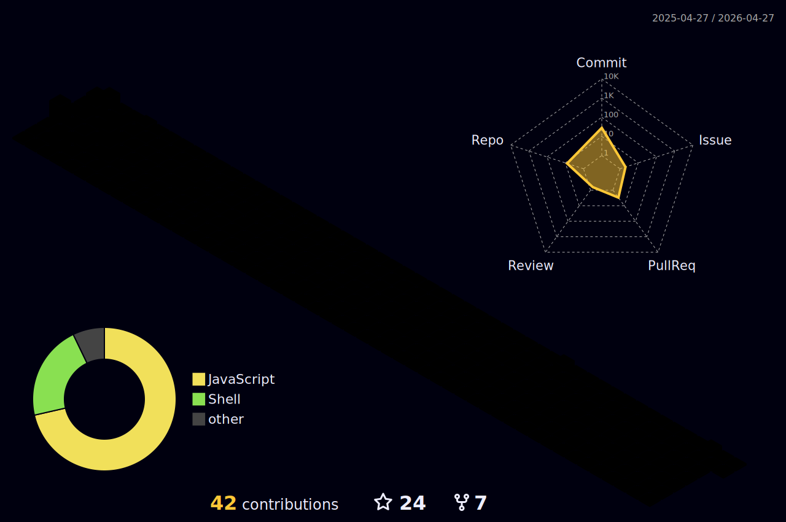

### Hi I'm mikeyang01 👋

<!--
**mikeyang01/mikeyang01** is a ✨ _special_ ✨ repository because its `README.md` (this file) appears on your GitHub profile.
-->

## ⚡ Platforms

## ⚡ Tech Stacks

## 🌎 Find me  
- 📧 邮箱: 
- 📝 博客: 
- 📮 X(Twitter)

## 🚀 Blog Posts
<!-- BLOG-POST-LIST:START -->
- [如何用 OpenAI Realtime API 打造一个实时语音助手](https://blog.mikeyang.org/openai-realtime-voice-agent)
- [一文理解 WebSocket 和 WSS 的部署实践](https://blog.mikeyang.org/websocket-wss-deployment)
- [打造一个AI语音客服系统，用Twilio实现外呼](https://blog.mikeyang.org/twilio-ai-voicebot)
- [数字人系统部署与低延迟优化](https://blog.mikeyang.org/digital-human-infra)
<!-- BLOG-POST-LIST:END -->

## 🌍 Visitors

